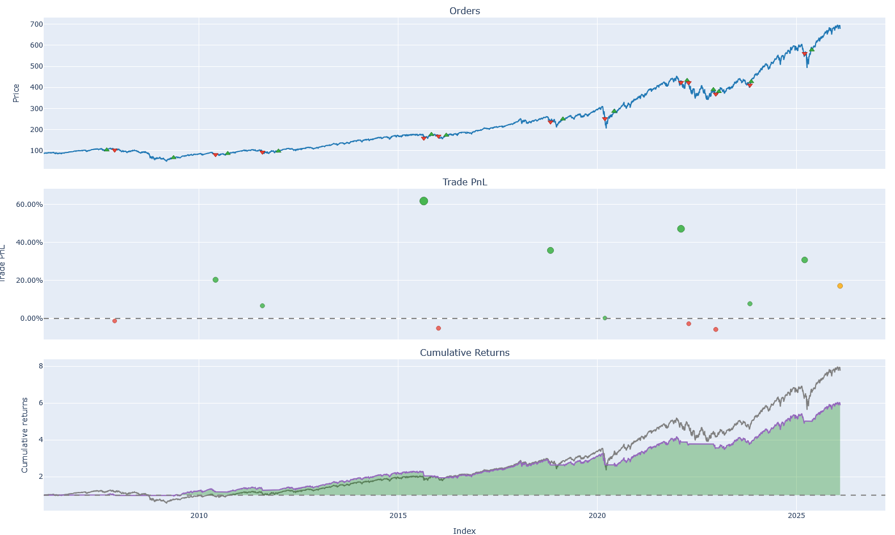

# Projekt Inwestycyjny AI: Backtester v2

Zadaniem programu jest wykonywanie zaawansowanych backtestów dla pomysłów inwestycyjnych opartych o:
* **Wskaźniki fundamentalne**
* **Akcję cenową (Price Action)**
* **Wskaźniki techniczne**

## Obecny stan projektu
Projekt jest w fazie budowy szkieletu aplikacji:
* **Moduł danych:** Pobieranie danych historycznych (interwały dzienne) dla wybranego indeksu (np. SPY) do 20 lat wstecz.
* **Silnik testowy:** Implementacja masowych backtestów (Grid Search) z wykorzystaniem biblioteki `vectorbt`.
* **Optymalizacja:** Mechanizm szukania najlepszych parametrów strategii (np. przecięcia średnich SMA).

## Wyniki Strategii SMA (15, 170)
Poniżej przedstawiam wyniki optymalizacji dla indeksu SPY (dane 2006-2026). Strategia ta cechuje się znacznie niższym obsunięciem kapitału (Drawdown ~21%) niż sam indeks, przy solidnym wzroście kapitału.

## Plany rozwoju
* [ ] Rozszerzenie backtestów o dane fundamentalne i interwały intraday.
* [ ] Integracja z **Langfuse** do monitoringu i logowania pracy agentów AI.
* [ ] Budowa interfejsu w **Streamlit** do interaktywnej wizualizacji i wprowadzania reguł strategii.
* [ ] Implementacja bardziej złożonych systemów (RSI, Bollinger Bands, analiza sentymentu).